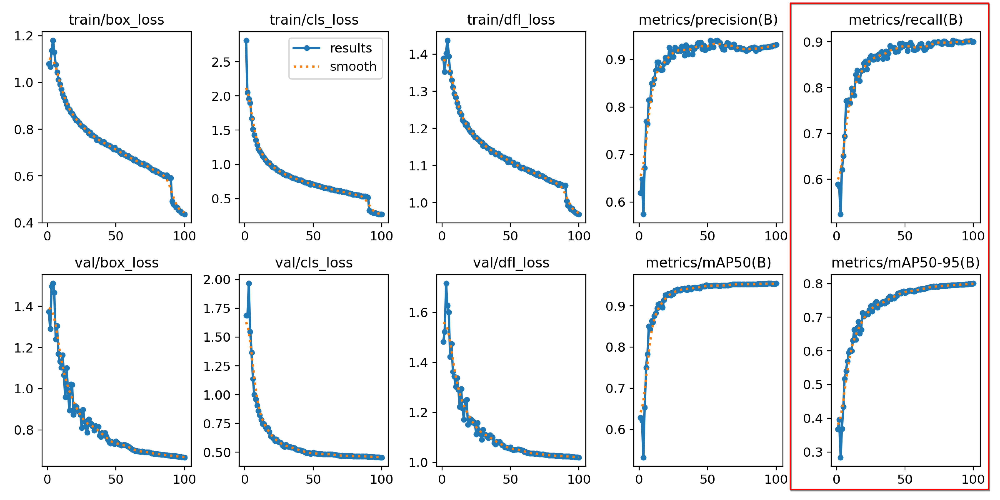

# YOLO-Beverage Containers
A YOLO-based beverage container detection model deployed on HuggingFace 🤗


## Deployed App
I chose HuggingFace Spaces as the deployment platform for quick prototyping and ease of use.

**Link to the app**: [Beverage Detector](https://huggingface.co/spaces/barath19/BeverageContainer-Detector)

The app is running on a free HuggingFace space, which is powered by 2 CPUs and no GPU. As a result, the inference speed is slower compared to GPU-based deployments.

## Training the Model

### Step 1: Download the Dataset and Pretrained YOLO Model

1. Download the dataset from [here](https://universe.roboflow.com/roboflow-universe-projects/beverage-containers-3atxb/dataset/3) and extract it into a new folder named `dataset`.

2. Download the pretrained YOLOv8 weights, specifically `yolov8n.pt`, from [here](https://github.com/ultralytics/assets/releases/download/v8.2.0/yolov8n.pt) and place it in a new folder named `checkpoints`.

### Step 2: Create Conda Environment

```
conda create -n yolo python=3.8
conda activate yolo
```

## Step 3: Install Dependencies

```
pip install -r requirements.txt

```
## Step 4: Update Parameters (Optional)

```
epochs: 50
batch_size: 16
learning_rate: 0.01
model: "checkpoints/yolov8n.pt"
data: "dataset/data.yaml"  
img_size: 640
half: false
```
## Step 5: Train the YOLO Model
To start training, run the following command:
```
python train.py
```
## Results and discussion
#### Training plots


The bounding box mAP50 performs well on the validation set. However, mAP50-95 on the validation set is lower than the training performance, indicating slight overfitting on the dataset.

#### Confusion matrix


There are several false positives, especially with incorrect predictions on the background class (as seen in the last column of the matrix).
### Training Hardware Setup

Ryzen 9 + RTX 3070 (2 hours of training, 100 epochs at batch size 16)

The experiments and the artifacts were tracked using mlflow.


### Improvements

- Implement DVC for dataset version control and tracking.
- Set up continuous deployment to HuggingFace Spaces for automated model updates.